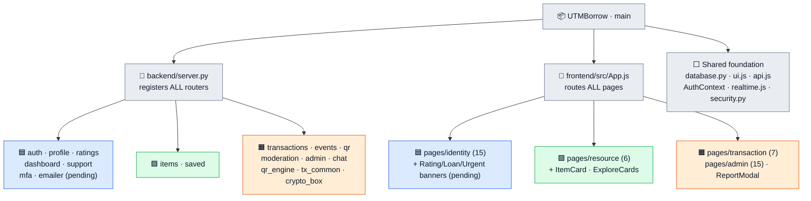

# UTM Borrow

A campus-wide **circular resource-sharing platform** for the Universiti Teknologi Malaysia (UTM)
community. Verified students lend and borrow academic resources — laboratory tools, engineering
equipment, textbooks and event clothing — instead of buying expensive single-use items. Every loan
runs through a strict state machine and each physical handover/return is proven with a
cryptographically signed QR code.

> Built for **SCSE2243 Application Development I — Section 01, Semester II 2025/2026**
> Group **Alpha** · Prepared for **Dr. Mohd Yazid Bin Idris**

This repository is the **Coding Phase** deliverable — the reorganized, simplified build of the system
specified in our **Proposal**, **SRS**, and **SDD**, grouped by the **three subsystems / nine modules**
those documents define.

## Team & Subsystem Ownership

| Subsystem | Developer | Matric |
|-----------|-----------|--------|
| Identity & User Management | Ahmat Mahamat Mourdji Moustapha | A24CS4053 |
| Resource Catalog & Discovery | Muaz Ibne Ahmed | A23CS4062 |
| Transaction & Handover | Mohammed Mohsen Mohammed Alsakkaf | A23CS4026 |

## Tech Stack

| Layer | Technology |
|-------|-----------|
| Frontend | React 18 (Create React App), React Router v6, Tailwind CSS v3, Framer Motion, Phosphor Icons, Axios |
| Backend | FastAPI (Python), Motor (async MongoDB driver), PyJWT, bcrypt |
| Database | MongoDB (local `:27017` or Atlas) |
| Realtime | Server-Sent Events (SSE) — push-only live updates |
| Security | JWT sessions, bcrypt password hashing, TOTP 2FA, HMAC-SHA256 signed QR tokens |

The stack matches the **SDD §1.4 — Technology and Tool Used** exactly.

---

Each subsystem owns **three modules** (nine modules total — SRS §1.4). For every module the table lists
its **Frontend** (screens + components) and **Backend** (routers + core modules).

## Identity & User Management Subsystem
Foundational security and accountability layer: who can enter the system, their public identity, and
their reputation.

**Developer: AHMAT MAHAMAT MOURDJI MOUSTAPHA**

| # | Module Name | Frontend | Backend | Database |
|---|-------------|----------|---------|----------|
| 1 | Authentication | **Screens:**<br>• [Login](frontend/src/pages/identity/Login.js)<br>• [Register](frontend/src/pages/identity/Register.js)<br>• [ForgotPassword](frontend/src/pages/identity/ForgotPassword.js)<br>• [ResetPassword](frontend/src/pages/identity/ResetPassword.js)<br>• [AuthShell](frontend/src/pages/identity/AuthShell.js) | **Routers:**<br>• [auth.py](Backend/routers/auth.py)<br><br>**Core modules:**<br>• [mfa.py](Backend/mfa.py) (TOTP 2FA)<br>• [emailer.py](Backend/emailer.py)<br>• [security.py](Backend/security.py) (shared) | **Files:**<br>• [database.py](Backend/database.py)<br>• [seed.py](Backend/seed.py)<br>**Collections:**<br>• `users`<br>• `user_sessions`<br>• `password_recovery_tokens` |
| 2 | Profile & Trust Score | **Screens:**<br>• [Profile](frontend/src/pages/identity/Profile.js)<br>• [PublicProfile](frontend/src/pages/identity/PublicProfile.js)<br>• [Reputation](frontend/src/pages/identity/Reputation.js)<br><br>**Components:**<br>• [RatingDialog](frontend/src/components/RatingDialog.js) | **Routers:**<br>• [profile.py](Backend/routers/profile.py)<br>• [ratings.py](Backend/routers/ratings.py) | **Files:**<br>• [database.py](Backend/database.py)<br>• [seed.py](Backend/seed.py)<br>**Collections:**<br>• `user_ratings`<br>• _updates_ `users.trust_score` |
| 3 | User Activity Dashboard | **Screens:**<br>• [Dashboard](frontend/src/pages/identity/Dashboard.js)<br><br>**Components:**<br>• [ActiveLoanBanner](frontend/src/components/ActiveLoanBanner.js)<br>• [UrgentBanner](frontend/src/components/UrgentBanner.js) | **Routers:**<br>• [dashboard.py](Backend/routers/dashboard.py) | **Files:**<br>• [database.py](Backend/database.py)<br>• [seed.py](Backend/seed.py)<br>**Collections:**<br>• _Read-only — owns no collections_<br>• _reads_ `transactions`, `lease_cycles`, `items`, `notifications` |

**Supporting account-management screens:** [SettingsHub](frontend/src/pages/identity/SettingsHub.js) · [SettingsSecurity](frontend/src/pages/identity/SettingsSecurity.js) · [NotificationPreferences](frontend/src/pages/identity/NotificationPreferences.js) · [HelpSupport](frontend/src/pages/identity/HelpSupport.js) · [Governance](frontend/src/pages/identity/Governance.js) · [MyReports](frontend/src/pages/identity/MyReports.js) — backed by [support.py](Backend/routers/support.py). Database: [database.py](Backend/database.py) · [seed.py](Backend/seed.py) — owns `help_tickets`.

## Resource Catalog & Discovery Subsystem
The browsing and search engine: publishing listings and finding items by category, condition and
campus location.

**Developer: MUAZ IBNE AHMED**

| # | Module Name | Frontend | Backend |
|---|-------------|----------|---------|
| 1 | Item Listing & Management | **Screens:**<br>• [Lend (My Listings)](frontend/src/pages/resource/Lend.js)<br>• [ItemForm (Add/Edit)](frontend/src/pages/resource/ItemForm.js)<br>• [ItemDetail](frontend/src/pages/resource/ItemDetail.js)<br><br>**Components:**<br>• [ItemCard](frontend/src/components/ItemCard.js) | **Routers:**<br>• [items.py](Backend/routers/items.py)<br>• [saved.py](Backend/routers/saved.py) (bookmarks) |
| 2 | Category & Condition Metadata | **Screens:**<br>• [Home (filter panel)](frontend/src/pages/resource/Home.js) | **Routers:**<br>• [items.py](Backend/routers/items.py) (server-side ENUM validation) |
| 3 | Location-Based Filter | **Screens:**<br>• [Home (college/faculty filter)](frontend/src/pages/resource/Home.js)<br>• [NearbyAll](frontend/src/pages/resource/NearbyAll.js)<br>• [PopularAll](frontend/src/pages/resource/PopularAll.js)<br><br>**Components:**<br>• [ExploreCards](frontend/src/components/ExploreCards.js) | **Routers:**<br>• [items.py](Backend/routers/items.py) (college/faculty query) |

**🗄️ Database (MongoDB):** [database.py](Backend/database.py) (connection + helpers) · [seed.py](Backend/seed.py) (collections, indexes & seed data) — owns collections: `items`, `saved_items`.

## Transaction & Handover Subsystem
The accountability engine: the loan lifecycle (Pending → Approved → Borrowed → Completed), QR-signed
handover/return, and community moderation.

**Developer: MOHAMMED MOHSEN MOHAMMED ALSAKKAF**

| # | Module Name | Frontend | Backend |
|---|-------------|----------|---------|
| 1 | Request & Approval Workflow | **Screens:**<br>• [TransactionDetail](frontend/src/pages/transaction/TransactionDetail.js)<br>• [TransactionHistory](frontend/src/pages/transaction/TransactionHistory.js)<br>• [Notifications](frontend/src/pages/transaction/Notifications.js) | **Routers:**<br>• [transactions.py](Backend/routers/transactions.py)<br>• [events.py](Backend/routers/events.py) (SSE stream)<br><br>**Core modules:**<br>• [tx_common.py](Backend/tx_common.py)<br>• [notifications.py](Backend/notifications.py)<br>• [realtime.py](Backend/realtime.py) |
| 2 | QR Verification | **Screens:**<br>• [Scanner](frontend/src/pages/transaction/Scanner.js) | **Routers:**<br>• [qr.py](Backend/routers/qr.py)<br><br>**Core modules:**<br>• [qr_engine.py](Backend/qr_engine.py) (HMAC-SHA256 tokens) |
| 3 | Community Moderation & Reporting | **Screens:**<br>• [Moderation](frontend/src/pages/transaction/Moderation.js)<br>• [ReportDetail](frontend/src/pages/transaction/ReportDetail.js)<br>• [Chat](frontend/src/pages/transaction/Chat.js)<br><br>**Components:**<br>• [ReportModal](frontend/src/components/ReportModal.js)<br><br>**Admin Portal (15 screens):**<br>• [AdminLayout](frontend/src/pages/admin/AdminLayout.js) · [AdminOverview](frontend/src/pages/admin/AdminOverview.js) · [AdminInbox](frontend/src/pages/admin/AdminInbox.js) · [AdminReports](frontend/src/pages/admin/AdminReports.js) · [AdminTransactions](frontend/src/pages/admin/AdminTransactions.js) · [AdminTransactionDetail](frontend/src/pages/admin/AdminTransactionDetail.js) · [AdminUsers](frontend/src/pages/admin/AdminUsers.js) · [AdminUserDetail](frontend/src/pages/admin/AdminUserDetail.js) · [AdminOverdue](frontend/src/pages/admin/AdminOverdue.js) · [AdminScan](frontend/src/pages/admin/AdminScan.js) · [AdminAudit](frontend/src/pages/admin/AdminAudit.js) · [AdminAnalytics](frontend/src/pages/admin/AdminAnalytics.js) · [AdminProfile](frontend/src/pages/admin/AdminProfile.js) · [AdminElevate](frontend/src/pages/admin/AdminElevate.js) · [AdminCommandPalette](frontend/src/pages/admin/AdminCommandPalette.js) | **Routers:**<br>• [moderation.py](Backend/routers/moderation.py)<br>• [admin.py](Backend/routers/admin.py)<br>• [chat.py](Backend/routers/chat.py)<br><br>**Core modules:**<br>• [crypto_box.py](Backend/crypto_box.py) (chat encryption)<br>• [mfa.py](Backend/mfa.py) — admin TOTP step-up |

**🗄️ Database (MongoDB):** [database.py](Backend/database.py) (connection + helpers) · [seed.py](Backend/seed.py) (collections, indexes & seed data) — owns collections: `transactions`, `transaction_state_logs`, `qr_tokens`, `scan_events`, `lease_cycles`, `reports`, `moderation_actions`, `notifications`, `admins`, `admin_audit`, `penalties`, `user_suspensions`, `chat_sessions`, `chat_messages`.


---

## Subsystem Ownership Map

The repository root splits into a shared trunk plus three owned zones. The two **🔗 integration files**
(`backend/server.py` and `frontend/src/App.js`) are where all three subsystems reconnect into one
running app.



**Where the subsystems reconnect**
- **`backend/server.py`** imports and mounts *every* subsystem's router → the backend trunk.
- **`frontend/src/App.js`** mounts *every* subsystem's pages into one route table → the frontend trunk.
- **Transaction → Identity/Resource live updates:** `realtime.js` + `notifications.py` push SSE events consumed by the Dashboard and listings.
- **Resource → Transaction data hand-off:** `items.py` catalog is what the transaction flow locks and lends.
- **Identity → all:** `security.py` (JWT) guards every router across all three subsystems.

---

## Project Structure

```
UTMBorrow/
├── README.md                  This file
├── START APP.bat              Windows launcher (backend :8000 + frontend :3000)
├── .gitignore
│
├── frontend/                  React single-page application
│   ├── public/index.html
│   ├── package.json · tailwind.config.js · postcss.config.js
│   └── src/
│       ├── App.js             Route table (public / student / admin)
│       ├── index.js · index.css
│       ├── components/        Reusable UI (ui.js, Layout, ItemCard, ReportModal, Toast, Skeleton, …)
│       ├── context/           AuthContext (session + current user)
│       ├── hooks/             useRouteRefresh
│       ├── lib/               api (Axios), realtime (SSE), format, motion
│       └── pages/
│           ├── identity/      Subsystem 1 — auth, profile, trust, dashboard, settings  (pending)
│           ├── resource/      Subsystem 2 — catalog, listing, discovery filters
│           ├── transaction/   Subsystem 3 — requests, QR, moderation, chat
│           └── admin/         Admin portal (moderation surface of Subsystem 3)
│
└── backend/                   FastAPI application
    ├── server.py              App entrypoint — registers all routers
    ├── database.py · seed.py  Mongo connection + indexes/seed
    ├── security.py            JWT/bcrypt auth core (shared foundation)
    ├── qr_engine.py           HMAC-SHA256 signed QR tokens
    ├── realtime.py · notifications.py · crypto_box.py
    ├── tx_common.py           Shared transaction helpers (state log, enrich)
    ├── routers/               One router per feature area
    └── tests/                 Pytest suite
```

The frontend `pages/` folders mirror the **three SRS subsystems** one-to-one. The backend keeps the
conventional flat FastAPI `routers/` layout (one router per feature area).

---

## Setup & Run

### Prerequisites
- **Node.js 18+** and **npm**
- **Python 3.11+**
- **MongoDB** running locally on `:27017` (or a MongoDB Atlas connection string)

### One-click (Windows)
From the project root, run **`START APP.bat`** — on first run it creates the backend virtual
environment, installs dependencies, then launches the API (`:8000`) and the React app (`:3000`).

### Manual

**Backend (FastAPI — http://localhost:8000)**
```bash
cd backend
python -m venv .venv
.venv\Scripts\activate          # Windows  (use: source .venv/bin/activate on macOS/Linux)
pip install -r requirements.txt
copy .env.example .env          # then edit MONGO_URL / JWT_SECRET / QR_HMAC_SECRET
python -m uvicorn server:app --reload
```
The API serves all routes under `/api`; health check at `GET /api/health`. On first run, `seed.py`
creates indexes and seed data automatically.

> ⚠️ The backend imports every subsystem's router, so it will not start until the **Identity
> subsystem (pending)** is added.

**Frontend (React — http://localhost:3000)**
```bash
cd frontend
npm install
copy .env.example .env          # REACT_APP_BACKEND_URL=http://localhost:8000
npm start
```